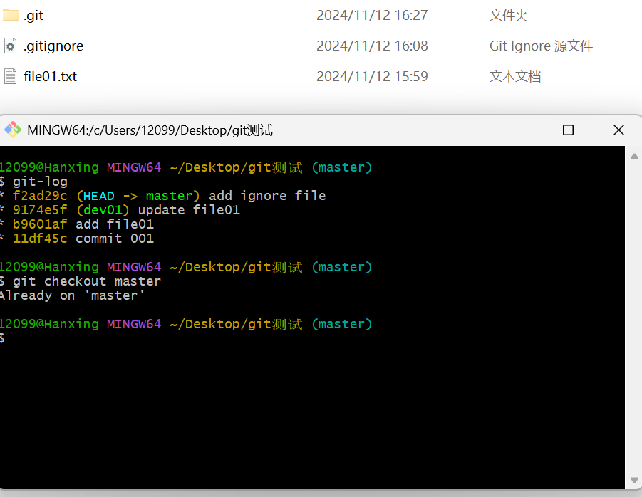
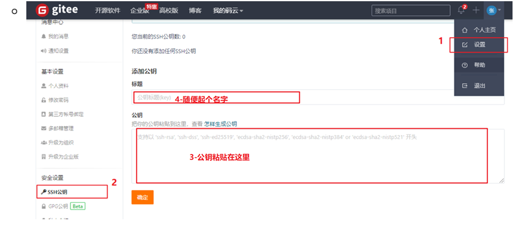

## git学习笔记

### 为常用指令配置别名
由于有的常用指令参数比较多，每次都要输入好多参数，我们可以使用别名。
1. 打开用户目录，创建.bashrc文件
   ```
   touch ~/.bashrc
   ```
2. 在.bashrc文件种输入如下内容:
  ```
  #用于输出git提交日志
  alias git-log='git log --pretty=oneline --all --graph --abbrev-commit'
  #用于输出当前目录所有文件及基本信息
  alias ll='ls -al'
  ```
### 常见命令
1. 获取本地仓库
   - 在需要进行版本控制的目录，右键点击Git bash窗口
   - 执行命令git init
```
git init
```

1. 基础操作指令
   Git工作目录下对于文件的修改（增加、删除、更新）会存在几个状态，这些修改的状态会随着我们执行Git的命令而发生改变
   

**添加工作区到暂存区，提交暂存区到本地仓库commit**

```
git add(工作区->暂存区)
// git add 单个文件名|通配符
git commit(暂存区->本地仓库)
// git commit -m '注释内容'
```

**查看修改的状态status**
- 作用：查看修改的状态（暂存区、工作区）
- 命令形式：git status

**查看提交日志log**
git log [option]
- options
  - --all显示所有分支
  - --pretty=online 将提交信息显示为一行
  - --abbrev-commit 使得输出的commitld更简短
  - --graph 以图的形式显示

**版本回退**
- 作用：版本切换
  命令形式：git reset --hard commitID
  - commitID可以使用git-log 或者git log指令查看

可以发现，文件被清空了

输入之前的commitID，还可以回退到以前的版本

- 如何查看已经删除的记录?
  - git reflog
  - 这个指令可以看到已经删除的提交记录

**忽略版本管理**
一般我们总会有些文件无需纳入Git 的管理，也不希望它们总出现在未跟踪文件列表。 通常都是些自动生成的文件，比如日志文件，或者编译过程中创建的临时文件等。 在这种情况下，我们可以在工作目录
中创建一个名为 .gitignore 的文件（文件名称固定），列出要忽略的文件模式。下面是一个示例
```
touch .gitignore
vi .gitignore
```


#### 分支
使用分支意味着可以把工作从开发主线上分离开进行重大的bug修改、开发新的功能，以免影响开发主线。

**查看分支**
```
git branch
```


**新建分支**
```
git branch dev01
git branch
```


**切换分支**
```
git checkout 分支名
```


也可以
```
git checkout -b 分支名
```
同时创建并且切换

**合并分支**
一份分支上的提交可以合并到另外一个分支
```
git merge 分支名称
```

**删除分支**
不能删除当前分支，只能删除其他分支
git branch -d b 删除分支时，需要做各种检查
git branch -D b1 不做任何检查，强制删除

**解决冲突**
当两个分支上对文件的修改可能会存在冲突，例如同时修改了同一个文件的同一行，这时就需要手动解决冲突，解决冲突步骤如下：
1. 处理文件中冲突的地方
2. 将解决完冲突的文件加入暂存区(add)
3. 提交到仓库(commit)


##### 开发中分支使用原则与流程
几乎所有的版本控制系统都以某种形式支持分支。 使用分支意味着你可以把你的工作从开发主线上分离开来进行重大的Bug修改、开发新的功能，以免影响开发主线。
在开发中，一般有如下分支使用原则与流程：

- **master （生产） 分支**：
  线上分支，主分支，中小规模项目作为线上运行的应用对应的分支；
- **develop（开发）分支**：
  是从master创建的分支，一般作为开发部门的主要开发分支，如果没有其他并行开发不同期上线要求，都可以在此版本进行开发，阶段开发完成后，需要是合并到master分支,准备上线。
- **feature/xxxx分支**
  从develop创建的分支，一般是同期并行开发，但不同期上线时创建的分支，分支上的研发任务完成后合并到develop分支。
- **hotfix/xxxx分支，**
  从master派生的分支，一般作为线上bug修复使用，修复完成后需要合并到master、test、develop分支。
- 还有一些其他分支，在此不再详述，例如test分支（用于代码测试）、pre分支（预上线分支）等
等。


### Git远程仓库
#### 常用的托管服务
```
前面我们已经知道了Git中存在两种类型的仓库，即本地仓库和远程仓库。那么我们如何搭建Git远程仓库呢？
我们可以借助互联网上提供的一些代码托管服务来实现，其中比较常用的有GitHub、码云、GitLab等。

gitHub（ 地址：https://github.com/ ）是一个面向开源及私有软件项目的托管平台，因为只支持Git 作为唯一的版本库格式进行托管，故名gitHub

码云（地址： https://gitee.com/ ）是国内的一个代码托管平台，由于服务器在国内，所以相比于GitHub，码云速度会更快

GitLab （地址： https://about.gitlab.com/ ）是一个用于仓库管理系统的开源项目，使用Git作为代码管理工具，并在此基础上搭建起来的web服务,一般用于在企业、学校等内部网络搭建git私服。
```

#### 创建远程仓库
在码云的页面里面找到新建就可以了
配置完成后会，得到一个远程仓库的地址


**配置SSH公钥**
1. 生成SSH公钥
   - ```ssh-keygen -t rsa```
   - 不断回车
     - 如果公钥已经存在，则自动覆盖

2. Gitee设置账户公共钥
   - 获取公钥
   - ```cat ~/.ssh/id_rsa.pub```
   - 
   - 验证是否成功 ```ssh -T git@gitee.com```

#### 操作远程仓库
**添加远程仓库**
```git remote add <远端名称> <仓库路径>```
  - 远端名称,默认是origin,取决于远端服务器设置
  - 仓库路径，从远端服务器获取此URL
  - 例如：git remote add origin git@gitee.com:quarrying/git_test.git
  - 

<br>

**查看远程仓库**
- ```git remote```
- 
<br>

**推送到远程仓库**
- ```git push [-f] [--set-upstream][远端名称[本地分支名][:远端分支名]]```
  - 如果远程分支名和本地分支名相同，则可以只写本地分支
    - ```git push origin master```
    - 
    - -f 表示强制覆盖
    - --set-upstream 推送到远端的同时并且建立起和远端分支的关联关系。
      - ```git push --set-upstream origin master```
      - 
      - 

    - **如果当前分支已经和远端分支关联，则可以忽略分支名和远端名**
      - ```git push```将master分支推送到已关联的远端分支。
      - 

<br>

**从远程仓库克隆**
- ```git clone```

**从远程仓库中抓取和拉取**
远程分支和本地的分支一样，我们可以进行merge操作，只是需要先把远端仓库里的更新都下载到本地，再进行操作。

- 抓取命令 :``` git fetch [remote name][branch name]```
  - **抓取指令就是将仓库里的更新都抓取到本地，不会进行合并**
  - 如果不指定远端名称和分支名，则抓取所有分支。

- 拉取命令：```git pull [remote name] [branch name]```
  - 拉取指令就是将远端仓库的修改拉到本地并自动进行合并，等同于fetch+merge
  - 如果不指定远端名称和分支名，则抓取所有并更新当前分支。


<br>

**解决合并冲突**
在一段时间，A和B用户修改了同一个文件，且修改了同一行位置的代码，此时会发生合并冲突。
A用户在本地修改代码后优先推送到远程仓库，此时B用户在本地修订代码，提交到本地仓库后，也需要推送到远程仓库，此时B用户晚于A用户，所以需要先拉去仓库的提交，经过合并后才能推送到远端分支，如下图所示。


在B用户拉去代码时，因为A、B用户同一段时间修改了同一文件的相同位置代码，故会发生合并冲突。

**远程分支也是分支，所以合并时冲突的解决方式也和解决本地分支冲突相同**


<br>
<br>

### Vim/Vi模式
启动Vim编辑器时，处于正常模式。
在这种模式下，可以使用Vim命令并浏览文件。

1. **进入编辑模式** 按 **i,a,o** 键
2. **返回正常模式** 按Esc
3. 打开文件(2种方法):
   - vim file.txt
   - 启动编辑器，然后输入:e file_name
4. **保存**： **W**
   保存文件但不退出编辑器：按Esc + 命令 **:w** + 按 Enter

5. **更新命令**:up
该命令仅在未保存更改的情况下才将缓冲区写入文件。
要使用其他名称保存文件，请键入:w new_filename并点击Enter。

6. 保存文件并退出Vim: 命令 **:wq**或者 **:x**
**两个命令的区别是:x仅在未保存更改时才将缓冲区写入文件，
:wq总是将缓冲区写入文件并更新文件修改时间。**
 按Esc + 命令:wq + 按Enter。

7. 退出Vim / Vi但不保存文件
按Esc + 命令:q! + 按Enter

常用操作:编辑package.json
终端命令vim package.json + i + 编辑内容 + 按Esc + :wq + 按Enter

